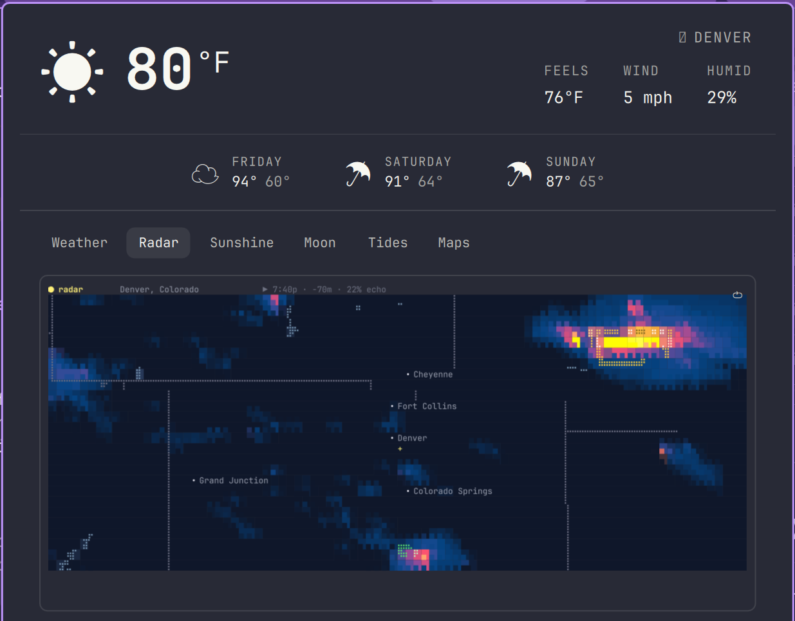
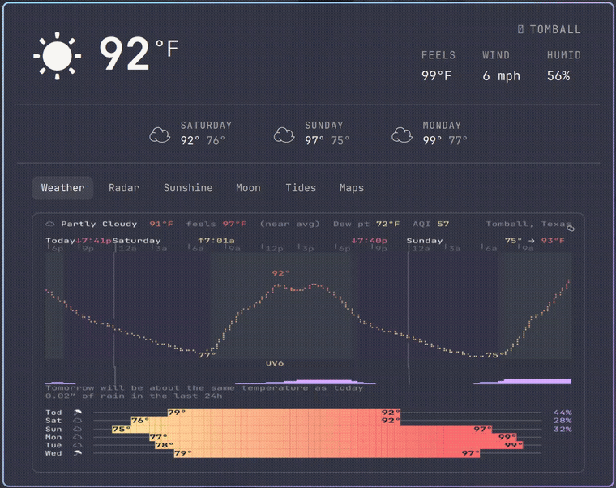

# Linecast for Omarchy

A companion to Omarchy's built-in weather widget: shows the current
temperature in the bar, and opens all six of linecast's views — Weather,
Radar, Sunshine, Moon, Tides, and Maps — live and interactive in one
popup, right from the menu bar.




## Credit

This plugin is a bar widget wrapper around **[linecast](https://github.com/ashuttl/linecast)**
by [Andrew Shuttleworth](https://github.com/ashuttl) (MIT licensed). All the
actual weather, radar, tide, sun, moon, and map data — and every bit of the
terminal rendering you see in the dashboard — comes from linecast. This
plugin doesn't reimplement any of that; it runs the real `linecast` CLI
in the background and replays its live terminal output onto a canvas inside
the Omarchy bar, with real keyboard and mouse input forwarded back into it.
None of linecast's code is bundled here — it's a required external
dependency you install separately (see below) — so full credit for
everything the dashboard actually shows belongs to linecast and its author.

If you find this useful, go star [linecast](https://github.com/ashuttl/linecast) too.

## Features

- **Bar pill**: current temperature + condition icon, refreshed periodically.
- **Click to open** one popup dashboard with all six of linecast's views —
  Weather, Radar, Sunshine, Moon, Tides, Maps — as tabs, each embedded
  and fully interactive right there; nothing opens in a separate window.
- **Actually live**, not a static snapshot — radar animation, live sun/moon
  position, etc., exactly like running `linecast` in a terminal.
- **Real interactivity**: keyboard shortcuts (e.g. radar's layer toggles
  and zoom, arrow-key time-scrubbing) and mouse — click, drag to pan,
  scroll to zoom on Maps — are forwarded into the running `linecast`
  process, not simulated.
- Renders at a fixed, uniform grid resolution so every tab looks consistent
  regardless of how much detail that particular view draws.

## Requirements

- [Omarchy](https://omarchy.org/) (Quickshell-based bar/shell)
- Python 3 (used only for a small pty-forwarding helper; no extra pip
  packages needed)
- **[linecast](https://github.com/ashuttl/linecast)** `2.2.0`, installed
  with the one command below — this is the exact release this plugin was
  last reviewed against (see [Security](#security) below). The plugin
  resolves and hash-verifies the installed package itself before every
  launch (never a bare PATH lookup, never a self-reported version string),
  and refuses to run at all on any mismatch.

  ```bash
  pip install --user --require-hashes -r requirements-linecast.txt
  ```

  `--require-hashes` fails closed if PyPI ever serves different bytes for
  this release — this is the one recommended, fully hash-bound install
  path. Verification itself isn't tied to that one install *method*,
  though: it resolves whatever `linecast` your shell's PATH actually
  finds, then hash-verifies that exact file against the installed
  package's own install-time record — which works the same way whether
  that installer was `pip`, `uv tool install`, or `pipx`, each of which
  writes the same kind of per-file hash record. What actually matters is
  that the *installed version* is exactly `2.2.0` with byte-identical
  files; an unpinned `uv tool install linecast` or similar that happens to
  land on a different version will still show a hard "backend
  verification failed" banner and not run until it matches.

## Installation

```bash
omarchy plugin add https://github.com/JMThomas00/omarchy-linecast.git --enable
```

Or manually:

```bash
git clone https://github.com/JMThomas00/omarchy-linecast.git \
  ~/.config/omarchy/plugins/linecast
omarchy plugin enable jmthomas00.linecast center
```

Move it around the bar with `omarchy bar move jmthomas00.linecast --section <left|center|right>`.

## Removal

```bash
omarchy plugin remove jmthomas00.linecast
```

Or manually:

```bash
omarchy plugin disable jmthomas00.linecast
rm -rf ~/.config/omarchy/plugins/linecast
```

Neither path touches anything outside this plugin's own folder and bar
placement -- linecast itself (installed separately, see Requirements
above) is untouched either way; remove it the same way you installed it
(`uv tool uninstall linecast`, `pipx uninstall linecast`, etc.) if you no
longer want it either.

## Usage

- **Click** the temperature pill to open the dashboard.
- **Click a tab** to switch views — Radar is the default.
- **Scroll / drag / click** inside a tab the same way you would in a real
  terminal running that linecast view (e.g. drag to pan Maps, scroll to
  zoom).
- Keyboard shortcuts linecast itself defines (radar's `s`/`c`/`w` layer
  toggles, `+`/`-` zoom, arrow keys to scrub through time) work when a tab
  has focus — click into it first.
- The small ⟳ in the top-right of the dashboard restarts the current tab's
  view if it ever gets stuck.
- **Esc** closes the dashboard. Note: this always closes the dashboard
  first, rather than dismissing anything linecast itself has open (e.g.
  radar's `t` theme picker) — those don't currently render through this
  plugin, so avoid opening them; if one gets triggered by accident, the
  same key that opened it (or the ⟳ restart button) gets back out.

## How it works, briefly

`linecast <view> --live` needs a real terminal (it uses cbreak mode for
input), which isn't available when a process is spawned headless by a
shell like Quickshell. `ptyrun.py` opens and sizes a pty itself and execs
linecast attached to it, then relays bytes in both directions: linecast's
output is parsed (`Ansi.js`) and painted onto a `Canvas`
(`TermCanvas.qml`), and keyboard/mouse events from the popup are encoded
back as terminal input (arrow keys, SGR mouse sequences) and written to
the pty — so it behaves like an actual terminal, not a recording of one.

## Security

This plugin's own code (QML, JS, `ptyrun.py`) is auditable in this
repository; `linecast` itself is upstream code this plugin runs but does
not bundle, reimplement, or review. This section covers the actual
process, input, output, and file boundaries this plugin's code crosses,
and how the two are bound together.

### Backend binding

`linecast` is installed by the user, separately from this plugin, from
PyPI (see Requirements above) — the marketplace-reviewed commit of this
repository controls none of the bytes that actually run as the backend
unless something actively verifies them at run time. It does:

- **Hash-verified install**: `requirements-linecast.txt` pins the exact
  release this plugin was reviewed against (`2.2.0`) with the sha256
  hashes PyPI published for its sdist and wheel, installable with
  `pip install --require-hashes`. This is the one recommended, fully
  hash-bound install command.
- **Fail-closed runtime verification**: every single spawn of `linecast`
  — every tab's `--live` process and the one-shot `weather --json` call —
  goes through `ptyrun.py`'s `resolve_verified_linecast()`, which never
  trusts a self-reported `--version` string (spoofable by any executable
  named `linecast` earlier on PATH). It uses PATH only to find a
  *candidate* file to check, never as a basis for trust: (1) resolves
  `linecast` on PATH to a real file, then looks up the `linecast`
  distribution that installed it through Python's own package database
  (`importlib.metadata`) — searched both in the default (`pip install
  --user`) location and, if the resolved file lives inside a venv (as
  `uv tool install`/`pipx install` each create one per tool), that venv's
  own site-packages — refusing if no such distribution is found; (2)
  requires its recorded version to be exactly `2.2.0`; (3) re-hashes every
  file the installer wrote for it — including the console-script entry
  point about to be exec'd — against the sha256 it recorded in `RECORD` at
  install time, refusing on any mismatch; (4) confirms the original PATH
  candidate is itself one of those verified files; and (5) only then execs
  that resolved, verified path directly, never a bare `linecast` argv0.
  Any failure at any of those steps is a hard block — the popup shows why
  (see `linecastVersionWarning` in `BarWidget.qml`) and no `linecast`
  process is spawned at all until it's fixed. This check runs fresh on
  every spawn, in `ptyrun.py` itself; a cached "OK" from the widget's own
  startup check is a UX convenience only and is never what actually
  authorizes a spawn.

### Process boundary (PTY)

Every `linecast <view> --live` process is spawned by `ptyrun.py` via
`os.fork()` + `os.execv()` with a fixed argv — never a shell, never a
concatenated command string — against the verified path from the backend
binding check above. `tabId` (the only variable part of that argv) is
validated by `isValidTab()` against this file's own hardcoded six-entry
tab list (`weather`/`radar`/`sunshine`/`moon`/`tides`/`maps`) before it
ever reaches `showTab()`/`ensureTabLive()`, including values arriving
through the `IpcHandler`'s `selectTab()` — an unrecognized or
option-looking value is rejected outright rather than reaching argv.
`weatherProc`'s one-shot `linecast weather --json` call goes through the
same `ptyrun.py` resolution (in its `--no-pty` mode) rather than a bare
argv0, so it's covered by the same verification.

Teardown is bounded and covers the whole process tree, not just the one
child pid: the pty child calls `os.setsid()` right after fork (making it
its own process-group leader), and `ptyrun.py`'s cleanup — run on
`SIGTERM`/`SIGHUP` and on normal exit alike — signals that whole group,
waits up to ~2s for it to actually exit, escalates to `SIGKILL` if it
hasn't, and reaps it. `PR_SET_PDEATHSIG` is armed on both `ptyrun.py` and
the child it forks, each immediately rechecking that its parent is still
alive right after arming (closing the race where the parent had already
exited in the window before the signal was armed, which would otherwise
leave PDEATHSIG never firing at all). On the QML side, `stopTab()` stops
exposing a tab's process as live immediately but only destroys the QML
object once `ptyrun.py` confirms the process actually exited, instead of
tearing it down while that bounded cleanup is still in flight underneath
it. Together this guarantees no `ptyrun.py`/`linecast` pair outlives panel
close, plugin disable, Quickshell exit, or a hard kill — confirmed
directly during development that without the PDEATHSIG piece, killed
sessions' process pairs were reparented to init and kept running
indefinitely.

### Input boundary

Keyboard events reach the running `linecast` process only through
`keyToBytes()`'s fixed switch-case (arrow keys, Enter, Backspace, Tab,
Page Up/Down, Home/End each map to one exact escape sequence) or, for
anything else, `event.text` filtered to printable characters
(`charCodeAt(0) >= 0x20`) — Escape is deliberately excluded so it always
closes the panel instead of reaching the pty. Mouse events are encoded as
fixed-format SGR sequences (`ESC[<btn;col;rowM`) with `col`/`row` computed
from cell geometry, never from unvalidated text. Both paths write straight
to the pty master fd (`Process.write()` / `os.write(master_fd, ...)`);
neither passes through a shell or an interpreter of any kind.

### Output boundary

`linecast`'s pty output is parsed by `Ansi.js` and painted by
`TermCanvas.qml`. The parser recognizes exactly one CSI terminator
(`m` — SGR color/bold) and treats every other CSI sequence
(cursor-move, erase-line/screen, private modes) as a no-op to discard;
nothing from that stream is ever `eval`'d, treated as HTML, or otherwise
interpreted as code — it becomes `ctx.fillText()`/`ctx.fillRect()` calls
on a `Canvas`, so there's no injection surface even if `linecast` (or a
process impersonating it) emitted adversarial bytes. `ptyrun.py`
additionally intercepts and answers only literal OSC 10/11/4 *query*
sequences itself (to supply Omarchy's theme colors); every other OSC
sequence passes through unmodified to the parser above, which discards it
the same way.

Both the transport and the parser are also byte/cardinality-bounded, not
just content-filtered: `BarWidget.qml`'s frame assembler kills a tab's
process outright if a single pty stream accumulates more than 1MB without
a frame boundary ever showing up (`maxPendingBytes`), the one-shot weather
fetch discards anything over 1MB before it ever reaches `JSON.parse`
(`maxJsonBytes`), and `Ansi.parseAnsi` itself caps a parsed frame to 2000
rows and 4000 characters per row (`MAX_LINES`/`MAX_LINE_CHARS`) regardless
of what the canvas grid ends up displaying — so a stream that never emits
the frame markers or record separators a well-behaved `linecast` always
does can't grow this plugin's own memory use without bound.

### File boundary

The only file this plugin's code reads is
`~/.local/state/omarchy/current/theme/colors.toml`. `current` is meant to
be a symlink (that's how Omarchy's theme switcher repoints the active
theme), so the parent directory chain is deliberately not restricted to
regular files — but the leaf file itself is opened as one atomic, fd-based
`open()` with `O_NOFOLLOW` (refuses if that exact path is a symlink) and
`O_NONBLOCK` (so a FIFO with no writer can't hang the open), then checked
via `fstat()` on the resulting descriptor — not a separate, spoofable
path-based `stat()` — to confirm it's a regular file owned by the current
user before a single byte is read, with the read itself bounded to 64KB
regardless. It's parsed with a narrow key/value regex, never executed or
passed to a shell, and used only to answer OSC color queries (see Output
boundary). Neither `ptyrun.py` nor the QML/JS here write, create, or
delete any file. Removal (see above) only ever deletes this plugin's own
install directory.

## License

The code in this repository (the Omarchy plugin itself — QML, JS, and the
Python pty helper) is licensed under the [MIT License](LICENSE).

linecast itself is separately licensed (MIT) by Andrew Shuttleworth — see
[its repository](https://github.com/ashuttl/linecast) for its own license
terms. This plugin is not affiliated with or endorsed by linecast's author;
it's an independent companion built to embed linecast's output in the
Omarchy bar.
