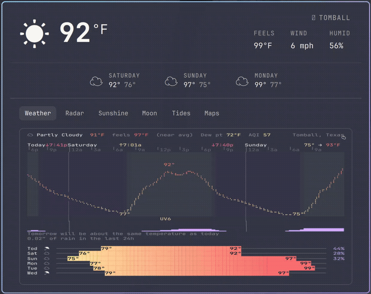

# Linecast for Omarchy

A companion to Omarchy's built-in weather widget: shows the current
temperature in the bar, and opens all six of linecast's views — Weather,
Radar, Sunshine, Moon, Tides, and Maps — live and interactive in one
popup, right from the menu bar.



## Credit

This plugin is a bar widget wrapper around **[linecast](https://github.com/ashuttl/linecast)**
by [Andrew Shuttleworth](https://github.com/ashuttl) (MIT licensed). All the
actual weather, radar, tide, sun, moon, and map data — and every bit of the
terminal rendering you see in the dashboard — comes from linecast. This
plugin doesn't reimplement any of that; it runs the real `linecast` CLI
in the background and replays its live terminal output onto a canvas inside
the Omarchy bar, with real keyboard and mouse input forwarded back into it.
None of linecast's code is bundled here — it's a required external
dependency you install separately (see below) — so full credit for
everything the dashboard actually shows belongs to linecast and its author.

If you find this useful, go star [linecast](https://github.com/ashuttl/linecast) too.

## Features

- **Bar pill**: current temperature + condition icon, refreshed periodically.
- **Click to open** one popup dashboard with all six of linecast's views —
  Weather, Radar, Sunshine, Moon, Tides, Maps — as tabs, each embedded
  and fully interactive right there; nothing opens in a separate window.
- **Actually live**, not a static snapshot — radar animation, live sun/moon
  position, etc., exactly like running `linecast` in a terminal.
- **Real interactivity**: keyboard shortcuts (e.g. radar's layer toggles
  and zoom, arrow-key time-scrubbing) and mouse — click, drag to pan,
  scroll to zoom on Maps — are forwarded into the running `linecast`
  process, not simulated.
- Renders at a fixed, uniform grid resolution so every tab looks consistent
  regardless of how much detail that particular view draws.

## Requirements

- [Omarchy](https://omarchy.org/) (Quickshell-based bar/shell)
- Python 3 (used only for a small pty-forwarding helper; no extra pip
  packages needed)
- **[linecast](https://github.com/ashuttl/linecast)** `2.3.1`, installed
  with the one command below — this is the exact release this plugin was
  last reviewed against (see [Security](#security) below). The plugin
  resolves and hash-verifies the installed package itself before every
  launch (never a bare PATH lookup, never a self-reported version string),
  and refuses to run at all on any mismatch.

  ```bash
  pip install --user --no-compile --require-hashes -r requirements-linecast.txt
  ```

  `--require-hashes` fails closed if PyPI ever serves different bytes for
  this release. `--no-compile` matters too, not just as an optimization:
  pip byte-compiles by default and records those `.pyc` paths in `RECORD`,
  which this plugin's verifier treats as files outside the reviewed
  manifest and refuses to run — `--no-compile` is what keeps a fresh `pip`
  install passing verification at all (see
  [Security → Backend binding](#backend-binding) for the *other* half of
  this, bytecode written the first time linecast actually runs rather than
  at install time, which this plugin's own code handles for you
  regardless of installer). This is the one recommended, fully hash-bound
  install path. Verification itself isn't tied to that one install
  *method*, though: it resolves whatever `linecast` your shell's PATH
  actually finds, then hash-verifies that exact file against
  `linecast-2.3.1.manifest.json` — a file *this repository ships and was
  reviewed at*, generated once from the official PyPI release, not
  against anything the installed environment self-reports — which works
  the same way whether the installer was `pip`, `uv tool install`, or
  `pipx`. What actually matters is that the *installed version* is
  exactly `2.3.1` with byte-identical files matching that committed
  manifest; an unpinned `uv tool install linecast` or similar that lands
  on a different (even same-version) artifact will still show a hard
  "backend verification failed" banner and not run until it matches. See
  [Security → Backend binding](#backend-binding) for why this changed
  from hashing against the installed package's own record.

## Installation

```bash
omarchy plugin add https://github.com/JMThomas00/omarchy-linecast.git --enable
```

Or manually:

```bash
git clone https://github.com/JMThomas00/omarchy-linecast.git \
  ~/.config/omarchy/plugins/linecast
omarchy plugin enable jmthomas00.linecast center
```

Move it around the bar with `omarchy bar move jmthomas00.linecast --section <left|center|right>`.

## Removal

```bash
omarchy plugin remove jmthomas00.linecast
```

Or manually:

```bash
omarchy plugin disable jmthomas00.linecast
rm -rf ~/.config/omarchy/plugins/linecast
```

Neither path touches anything outside this plugin's own folder and bar
placement -- linecast itself (installed separately, see Requirements
above) is untouched either way; remove it the same way you installed it
(`uv tool uninstall linecast`, `pipx uninstall linecast`, etc.) if you no
longer want it either.

## Usage

- **Click** the temperature pill to open the dashboard.
- **Click a tab** to switch views — Radar is the default.
- **Scroll / drag / click** inside a tab the same way you would in a real
  terminal running that linecast view (e.g. drag to pan Maps, scroll to
  zoom).
- Keyboard shortcuts linecast itself defines (radar's `s`/`c`/`w` layer
  toggles, `+`/`-` zoom, arrow keys to scrub through time) work when a tab
  has focus — click into it first.
- The small ⟳ in the top-right of the dashboard restarts the current tab's
  view if it ever gets stuck.
- **Esc** closes the dashboard. Note: this always closes the dashboard
  first, rather than dismissing anything linecast itself has open (e.g.
  radar's `t` theme picker) — those don't currently render through this
  plugin, so avoid opening them; if one gets triggered by accident, the
  same key that opened it (or the ⟳ restart button) gets back out.

## How it works, briefly

`linecast <view> --live` needs a real terminal (it uses cbreak mode for
input), which isn't available when a process is spawned headless by a
shell like Quickshell. `ptyrun.py` opens and sizes a pty itself and execs
linecast attached to it, then relays bytes in both directions: linecast's
output is parsed (`Ansi.js`) and painted onto a `Canvas`
(`TermCanvas.qml`), and keyboard/mouse events from the popup are encoded
back as terminal input (arrow keys, SGR mouse sequences) and written to
the pty — so it behaves like an actual terminal, not a recording of one.

## Known limitations

**The rendering gap that used to block newer releases is fixed; the pin
is still `2.3.1` pending a separate decision to move it.** Starting with
linecast `2.4.0`, every `--live` view's redraw strategy changed to
absolute per-row cursor addressing (`ESC[row;colH` before every line),
dropping plain newlines from the stream entirely. That broke this plugin
outright on anything `2.4.0`+ (every tab showed "No data," indefinitely)
until two things changed, credit to
[@db48x](https://github.com/JMThomas00/omarchy-linecast/issues/5) for the
core insight that made the fix far smaller than first expected:

- `Ansi.js` now tracks which row index is being written to (set by the
  cursor-position escape), rather than only ever appending to whatever
  row was last pushed — no column tracking needed, since every core view
  (radar, weather, sunshine, moon, maps) always repositions to column 1
  immediately followed by an erase-line, i.e. "clear and rewrite this
  whole row." (Known, accepted gap: tides has two small sub-row overlays
  — a live clock and the current tide height — that land at a nonzero
  column with no erase-line; without column tracking these end up
  appended to the row's existing content instead of precisely positioned.
  Cosmetic only, same tier as the already-documented theme-picker gap.)
- `SplitParser`'s `splitMarker` is now `""` instead of relying on the
  default `"\n"` — with zero newlines anywhere in `2.4.0+`'s stream,
  Quickshell would otherwise never find a delimiter to call `onRead` on
  at all, independent of anything `Ansi.js` does with what it's given.

Verified directly against real output from all six views on `2.10.0`
(screenshots, not just captured bytes), with no regression on the `2.3.1`
backward-compatible path. Whether to actually move the pin off `2.3.1`
now that the renderer supports newer releases is tracked separately in
[#2](https://github.com/JMThomas00/omarchy-linecast/issues/2) and
[#5](https://github.com/JMThomas00/omarchy-linecast/issues/5) — a version
bump also needs a fresh manifest/`requirements-linecast.txt` and another
marketplace revalidation round, so it's a deliberate follow-up, not a
side effect of this fix.

## Security

This plugin's own code (QML, JS, `ptyrun.py`) is auditable in this
repository; `linecast` itself is upstream code this plugin runs but does
not bundle, reimplement, or review. This section covers the actual
process, input, output, and file boundaries this plugin's code crosses,
and how the two are bound together.

### Backend binding

`linecast` is installed by the user, separately from this plugin, from
PyPI (see Requirements above) — the marketplace-reviewed commit of this
repository controls none of the bytes that actually run as the backend
unless something actively verifies them at run time. It does:

- **Hash-verified install**: `requirements-linecast.txt` pins the exact
  release this plugin was reviewed against (`2.3.1`) with the sha256
  hashes PyPI published for its sdist and wheel, installable with
  `pip install --require-hashes`. This is the one recommended, fully
  hash-bound install command.
- **A committed trust root, not the installed environment's own word
  about itself**: `linecast-2.3.1.manifest.json` in this repository — not
  anything read from wherever `linecast` ends up installed — is what
  every hash comparison below is made against. It's generated once,
  directly from the official `linecast-2.3.1` wheel published to PyPI
  (the same artifact `requirements-linecast.txt` pins by hash), and lists
  the sha256 of every file that wheel actually contains, plus its
  `console_scripts` entry point (`linecast.__main__:main`). An earlier
  version of this check instead re-hashed installed files against that
  same installation's own `RECORD` — which is written by whatever did the
  installing, so an unpinned `uv tool install`/`pipx install` of a
  *different* `linecast` 2.3.1 artifact could self-report a consistent
  but unreviewed `RECORD` and pass. Hashing against a manifest shipped and
  reviewed at this plugin's own commit closes that gap: the bytes have to
  match what was actually reviewed, not just be internally consistent
  with each other.
- **Fail-closed runtime verification**: every single spawn of `linecast`
  — every tab's `--live` process and the one-shot `weather --json` call —
  goes through `ptyrun.py`'s `resolve_verified_linecast()`, which never
  trusts a self-reported `--version` string (spoofable by any executable
  named `linecast` earlier on PATH). It uses PATH only to find a
  *candidate* file to check, never as a basis for trust: (1) resolves
  `linecast` on PATH to a real file, then looks up the `linecast`
  distribution that installed it through Python's own package database
  (`importlib.metadata`) — searched both in the default (`pip install
  --user`) location and, if the resolved file lives inside a venv (as
  `uv tool install`/`pipx install` each create one per tool), that venv's
  own site-packages — refusing if no such distribution is found; (2)
  requires its recorded version to match the manifest's (`2.3.1`); (3)
  re-hashes every file the distribution claims to own against the sha256
  pinned for that exact relative path in the manifest, refusing on any
  mismatch, any file the manifest doesn't recognize, or any manifest file
  missing from the installation (installer-only bookkeeping like
  `RECORD`/`INSTALLER`/`direct_url.json` is exempted — it's never imported
  or executed); (4) separately verifies the console-script launcher about
  to be exec'd, which isn't one of the distribution's own files so step 3
  can't cover it — its shebang must name a real python interpreter inside
  that same venv (checked against the literal shebang path, not fully
  resolved, since a venv's own `bin/python` is itself normally a symlink
  out to the base interpreter; a bare `-E` after the interpreter path is
  the one accepted exception, since `pipx`'s own generated launchers carry
  it and it's a hardening flag — ignore `PYTHON*` env vars — not a
  weakening one), and its entire body must do nothing but import and call
  the manifest's pinned `module:attr` entry point, parsed and checked
  statement-by-statement — any additional import, call, or statement is a
  hard failure rather than something silently allowed through. This
  extends to every argument slot on every call the checker recognizes, not
  just which function is being called: the one optional extra line
  installers commonly add (stripping a packaging suffix off `sys.argv[0]`,
  in whichever of the three exact forms distlib, `uv`, or current `pip`
  actually generates) is matched down to its exact literal
  arguments/receiver/method — a fixed pattern string, an empty literal
  replacement, `sys.argv[0]` as the sole subject, no keywords — rather
  than merely confirming the call target, since Python evaluates a call's
  arguments eagerly regardless of what the call itself does with them; an
  earlier version of this check verified only the call target for the
  `re.sub` form and missed exactly that, letting a tampered launcher
  smuggle a side-effecting expression in as one of its arguments (caught
  in marketplace review — see
  [omacom/omarchy-plugin-marketplace#3421](https://github.com/omacom/omarchy-plugin-marketplace/issues/3421)).
  The same reasoning applies to `sys.exit(...)`'s own keyword arguments,
  which are required empty for the same reason; and (5) only then execs
  that resolved, verified path directly, never a bare `linecast` argv0.
  Any failure at any of those steps is a hard block — the popup shows why
  (see `linecastVersionWarning` in `BarWidget.qml`) and no `linecast`
  process is spawned at all until it's fixed. This check runs fresh on
  every spawn, in `ptyrun.py` itself; a cached "OK" from the widget's own
  startup check is a UX convenience only and is never what actually
  authorizes a spawn.
- **No cached bytecode left to shadow a verified source file**: hashing a
  `.py` file proves nothing about what Python actually executes if a
  stale or planted `__pycache__/*.pyc` sits next to it with an
  invalidation header (mtime+size, or a PEP 552 hash) that still matches
  — Python's import system loads that cache instead of re-reading the
  bytes just verified. `resolve_verified_linecast()` deletes any existing
  cache for every file it hashes, every single spawn, and the environment
  `linecast` is actually exec'd in sets `PYTHONDONTWRITEBYTECODE=1` so a
  fresh one can't be written back in between spawns either — together
  these mean the verified `.py` source is what runs, every time,
  regardless of what any installer did or what ran before. (A `pip`
  install's own *install-time* compiled `.pyc`, which lands in `RECORD`
  rather than being silently shadowed, is a separate case `--no-compile`
  handles — see Requirements above.) Reported directly — see
  [JMThomas00/omarchy-linecast#1](https://github.com/JMThomas00/omarchy-linecast/issues/1)
  and
  [#3](https://github.com/JMThomas00/omarchy-linecast/issues/3).

### Process boundary (PTY)

Every `linecast <view> --live` process is spawned by `ptyrun.py` via
`os.fork()` + `os.execv()` with a fixed argv — never a shell, never a
concatenated command string — against the verified path from the backend
binding check above. `tabId` (the only variable part of that argv) is
validated by `isValidTab()` against this file's own hardcoded six-entry
tab list (`weather`/`radar`/`sunshine`/`moon`/`tides`/`maps`) before it
ever reaches `showTab()`/`ensureTabLive()`, including values arriving
through the `IpcHandler`'s `selectTab()` — an unrecognized or
option-looking value is rejected outright rather than reaching argv.
`weatherProc`'s one-shot `linecast weather --json` call goes through the
same `ptyrun.py` resolution (in its `--no-pty` mode) rather than a bare
argv0, so it's covered by the same verification.

Teardown is bounded and covers the whole process tree, not just the one
child pid: the pty child calls `os.setsid()` right after fork (making it
its own process-group leader), and `ptyrun.py`'s cleanup — run on
`SIGTERM`/`SIGHUP` and on normal exit alike — signals that whole group,
waits up to ~2s for it to actually exit, escalates to `SIGKILL` if it
hasn't, and reaps it. `PR_SET_PDEATHSIG` is armed on both `ptyrun.py` and
the child it forks, each immediately rechecking that its parent is still
alive right after arming (closing the race where the parent had already
exited in the window before the signal was armed, which would otherwise
leave PDEATHSIG never firing at all). On the QML side, `stopTab()` stops
exposing a tab's process as live immediately but only destroys the QML
object once `ptyrun.py` confirms the process actually exited, instead of
tearing it down while that bounded cleanup is still in flight underneath
it. Together this guarantees no `ptyrun.py`/`linecast` pair outlives panel
close, plugin disable, Quickshell exit, or a hard kill — confirmed
directly during development that without the PDEATHSIG piece, killed
sessions' process pairs were reparented to init and kept running
indefinitely.

### Input boundary

Keyboard events reach the running `linecast` process only through
`keyToBytes()`'s fixed switch-case (arrow keys, Enter, Backspace, Tab,
Page Up/Down, Home/End each map to one exact escape sequence) or, for
anything else, `event.text` filtered to printable characters
(`charCodeAt(0) >= 0x20`) — Escape is deliberately excluded so it always
closes the panel instead of reaching the pty. Mouse events are encoded as
fixed-format SGR sequences (`ESC[<btn;col;rowM`) with `col`/`row` computed
from cell geometry, never from unvalidated text. Both paths write straight
to the pty master fd (`Process.write()` / `os.write(master_fd, ...)`);
neither passes through a shell or an interpreter of any kind.

### Output boundary

`linecast`'s pty output is parsed by `Ansi.js` and painted by
`TermCanvas.qml`. The parser recognizes exactly one CSI terminator
(`m` — SGR color/bold) and treats every other CSI sequence
(cursor-move, erase-line/screen, private modes) as a no-op to discard;
nothing from that stream is ever `eval`'d, treated as HTML, or otherwise
interpreted as code — it becomes `ctx.fillText()`/`ctx.fillRect()` calls
on a `Canvas`, so there's no injection surface even if `linecast` (or a
process impersonating it) emitted adversarial bytes. `ptyrun.py`
additionally intercepts and answers two kinds of literal terminal
*queries* itself, stripping each out of what gets forwarded so neither
ever reaches the parser as stray text: OSC 10/11/4 colour queries (to
supply Omarchy's theme colors), and DSR cursor-position queries
(`ESC[6n`/`ESC[?6n`, answered with a fixed `row 1, column 1` — this relay
has no real notion of where the cursor actually is, so that's the best a
dumb byte relay can offer; linecast 2.4.0+ sends one of these to measure
how wide a multi-codepoint glyph rendered, and without an answer every
`--live` tab stalled partway through its first frame waiting on a reply
that never came — reported directly, see
[JMThomas00/omarchy-linecast#4](https://github.com/JMThomas00/omarchy-linecast/issues/4)).
Every other OSC/CSI sequence passes through unmodified to the parser
above, which discards it the same way.

Both the transport and the parser are also byte/cardinality-bounded, not
just content-filtered, and enforced on the producer side rather than only
after Quickshell's own buffering has already retained the data:
`ptyrun.py`'s relay loop (`_bounded_relay_write`) tracks how many bytes
it has forwarded since the last newline, for both the pty tabs and the
one-shot weather fetch alike, and refuses to relay any further once that
run exceeds 1MB (`_MAX_RELAY_RUN_BYTES`) — tearing the tab down (pty
path) or exiting without forwarding more (weather path) instead. This
matters because Quickshell's QML-side reader for each of those two paths
buffers internally *before* ever handing control back to our own code:
`SplitParser` (used for the pty tabs) holds an unterminated line
undelivered until it sees a newline, so `BarWidget.qml`'s own
`maxPendingBytes` check inside `onRead` never even runs on a stream that
never terminates a line; `StdioCollector` (used for the one-shot weather
fetch) retains the entire stream and only calls `onStreamFinished` once
it closes, so `maxJsonBytes` there only ever discards a string that's
already been fully retained. Enforcing the same 1MB ceiling one layer
earlier, on the raw bytes before Quickshell's own reader gets them at
all, means neither of those QML-side checks is actually the boundary —
they're a second layer over a limit `ptyrun.py` already guarantees.
`Ansi.parseAnsi` itself additionally caps a parsed frame to 2000 rows and
4000 characters per row (`MAX_LINES`/`MAX_LINE_CHARS`) regardless of what
the canvas grid ends up displaying.

### File boundary

The only file this plugin's code reads is
`~/.local/state/omarchy/current/theme/colors.toml`. `current` is meant to
be a symlink (that's how Omarchy's theme switcher repoints the active
theme), so the parent directory chain is deliberately not restricted to
regular files — but the leaf file itself is opened as one atomic, fd-based
`open()` with `O_NOFOLLOW` (refuses if that exact path is a symlink) and
`O_NONBLOCK` (so a FIFO with no writer can't hang the open), then checked
via `fstat()` on the resulting descriptor — not a separate, spoofable
path-based `stat()` — to confirm it's a regular file owned by the current
user before a single byte is read, with the read itself bounded to 64KB
regardless. It's parsed with a narrow key/value regex, never executed or
passed to a shell, and used only to answer OSC color queries (see Output
boundary). Neither `ptyrun.py` nor the QML/JS here write, create, or
delete any file. Removal (see above) only ever deletes this plugin's own
install directory.

## License

The code in this repository (the Omarchy plugin itself — QML, JS, and the
Python pty helper) is licensed under the [MIT License](LICENSE).

linecast itself is separately licensed (MIT) by Andrew Shuttleworth — see
[its repository](https://github.com/ashuttl/linecast) for its own license
terms. This plugin is not affiliated with or endorsed by linecast's author;
it's an independent companion built to embed linecast's output in the
Omarchy bar.
